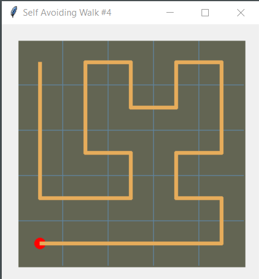

# Self Avoiding Walk

##### Bruce Wernick
##### 16 Sept 2021


Inspired initially by Dan Shiffman's
Coding Challenge 162: Self-Avoiding Walk

My latest attempt is the file saw4.py



##### Logic
The algorithm is based on this little loop.

```python
  path = [cp]
  history = {cp: Cell(cp)}
  while True:
    cp = history[cp].rand_step(path)
    if cp:
      path.append(cp)
      history[cp] = Cell(cp)
    else:
      xp = path.pop(-1)
      history[xp] = None  # kill the blocked step
      del xp
      cp = path[-1]  # backtrack 1 step
```

_path_ contains the latest list of (r,c) tuples.<br>
_history_ is a dictionary of Cells.<br>
_cp_ is the current position.<br>

_history[cp]_ is a pointer to the cell at
the current position.  And, 
_history[cp].rand_step(path)_ is where all 
the work happens.  It returns a random step 
if there is one.

Based on _cp_, we either add the new point to
the path or backtrack and delete the point
from the path.

A word of warning.  This is one of those impossible
problems to solve.  It works well for a 5x5 grid.  
Up to 8x8 is possible but over 10x10 and there 
just too many combinations.

I'm using tkinter to plot the progress but, 
it has a tedious setup and I can't seem to 
find a simple way to make it a plug-in.  In 
the coding train videos, Dan uses JavaScript 
with P5 and it looks ideal for this sort of 
thing.  I noticed that there is a p5 for 
python and tried **pip install p5**.  It took 
ages to install all its dependencies and 
their most basic example failed to run due 
to missing libraries.  So, I dumped it 
without trying any further.

If you have a suggesion for a simple canvas for
quick code plotting, please let me know.

